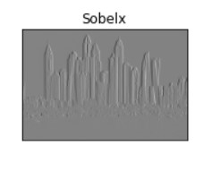
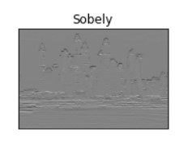
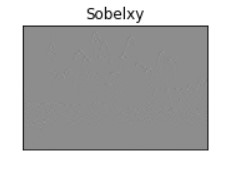
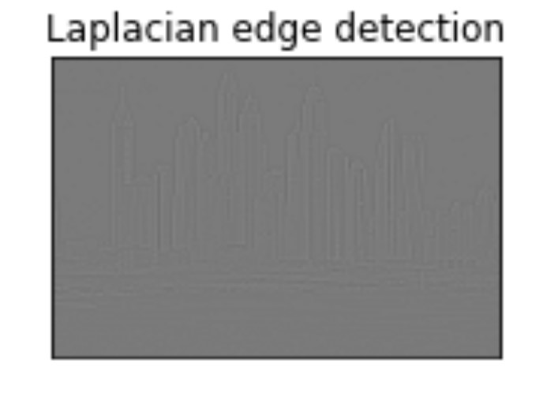
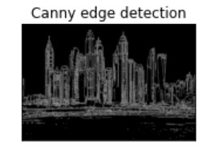

# Edge-Detection
## Aim:
To perform edge detection using Sobel, Laplacian, and Canny edge detectors.

## Software Required:
Anaconda - Python 3.7

## Algorithm:
### Step1:
Import the necessary packages matplolib and cv2.

### Step2:
Read the image as grayscale and reduce the noise using cv2.GaussianBlur.

### Step3:
Perform various methods of edge detection Sobel edge detector,Laplacian edge detector,Canny edge detector.

### Step4:
Run the program.

### Step5:
Execute the output.
 
## Program:

``` Python
 Developed by : SUBRAMANIYA PILLAI B
 Reference number : 212221230109
# Import the packages
import cv2
import matplotlib.pyplot as plt

# Load the image, Convert to grayscale and remove noise
image=cv2.imread('02.jpg')
gray=cv2.cvtColor(image,cv2.COLOR_BGR2GRAY)
gaus=cv2.GaussianBlur(gray,(3,3),0)


# SOBEL EDGE DETECTOR
sobelx=cv2.Sobel(gaus,cv2.CV_64F,1,0,ksize=5)
sobely=cv2.Sobel(gaus,cv2.CV_64F,0,1,ksize=5)
sobelxy=cv2.Sobel(gaus,cv2.CV_64F,1,1,ksize=5)
plt.figure(1)
plt.subplot(2,2,1)
plt.imshow(gaus,cmap='gray')
plt.title('Original image')
plt.xticks([])
plt.yticks([])
plt.show()
#sobelx
plt.subplot(2,2,1)
plt.imshow(sobelx,cmap='gray')
plt.title('Sobelx')
plt.xticks([])
plt.yticks([])
plt.show()
#sobely
plt.subplot(2,2,1)
plt.imshow(sobely,cmap='gray')
plt.title('Sobely')
plt.xticks([])
plt.yticks([])
#sobelxy
plt.subplot(2,2,1)
plt.imshow(sobelxy,cmap='gray')
plt.title('Sobelxy')
plt.xticks([])
plt.yticks([])
plt.show()


# LAPLACIAN EDGE DETECTOR
laplacian = cv2.Laplacian(gaus,cv2.CV_64F)
plt.subplot(2,2,1)
plt.imshow(laplacian,cmap='gray')
plt.title('Laplacian edge detection')
plt.xticks([])
plt.yticks([])
plt.show()


# CANNY EDGE DETECTOR
canny_edges=cv2.Canny(gaus,120,150)
plt.subplot(2,2,1)
plt.imshow(canny_edges,cmap='gray')
plt.title('Canny edge detection')
plt.xticks([])
plt.yticks([])
plt.show()
```
## Output:
### ORIGINAL IMAGE

### SOBEL EDGE DETECTOR

<br>


<br>



### LAPLACIAN EDGE DETECTOR



### CANNY EDGE DETECTOR


## Result:
Thus the edges are detected using Sobel, Laplacian, and Canny edge detectors.
